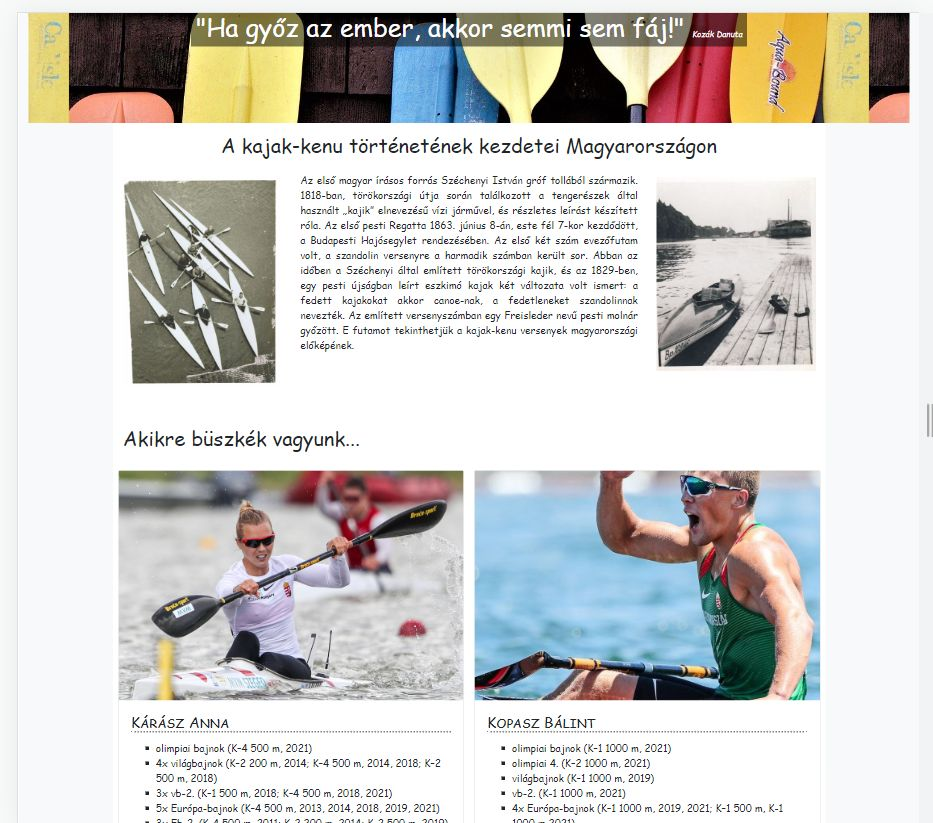
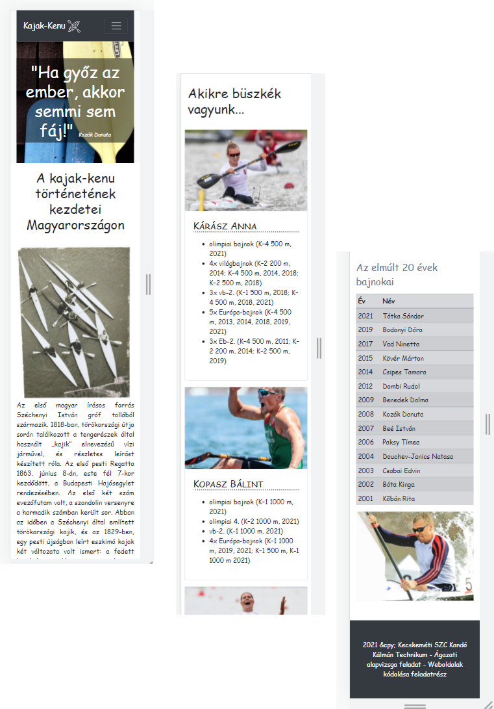

# Befejezetlen Reszponzív Oldal Feladat

A forrásban található egy befejezetlen reszponzív oldal, amely érdekességeket, sikereket mutat be a magyarországi kajak – kenu sportág világából. A mintának és a leírásnak megfelelően módosításokat kell elvégeznie a weboldalon, az `index.html` fájlon és a hozzátartozó `style.css` stíluslapon!

## Feladatok

1. A `banner` osztályjelölővel ellátott HTML elem magassága legyen 300 pixel és állítsa be háttérképnek a `banner.jpg` képfájlt melyet az `img` mappában talál. A háttérkép legyen középre helyezve vízszintesen is és függőlegesen is. Mindezt a stíluslapban valósítsa meg a megfelelő szelektor létrehozásával.

2. A főcímben szereplő név (Kozák Danuta) legyen dőlt betűs, valósítsa meg HTML elem hozzáadásával. Betűmérete legyen a böngésző alapértelmezett betűméretének 80%-a, ezt a stíluslapon valósítsa meg.

3. A főcím betű színét pedig cserélje le fehérre Bootstrap osztályjelölőt használva!

4. A weboldalak menüjét egészítse ki egy új „Történelem” menüponttal, amely [https://tortenelem.kajakkenusport.hu/](https://tortenelem.kajakkenusport.hu/) oldalra mutat! Állítsa be, hogy a linkre kattintva az oldal új lapon jelenjen meg a böngészőben!

5. A `mult` azonosítójú `section` elemben található 3 oszlop elrendezését módosítsa úgy, hogy a középső oszlopban levő szövegnek 2-szer annyi helye legyen medium töréspontnál (a közepes eszközöktől felfele) mint a jobb és bal széleken levő fotóknak.

6. A kártyákat tartalmazó oszlopok a `buszke` azonosítójú `section` elemben, a közepes eszközöktől felfele (medium töréspontnál) jelenjenek meg 2 oszlopos elrendezésben.

7. A `bajnokok` azonosítójú `section` elemben található táblázatnak csak a fejrésze készült el. Az adatokat megtalálja a `bajnokok.txt` fájlban, töltse fel a táblázatot ezekkel az adatokkal.

8. A `bajnokok` azonosítójú `section` elemben található kép legyen reszponzív.

9. A kártyákon belüli 4-es szintű címsorokra a következő formázásokat állítsa be a stíluslapon:
    a. Az alcím aljára helyezzen el egy 3 pixel vastag pontozott stílusú szegélyt!
    b. Az alcím legyen kiskapitális stílusú!

